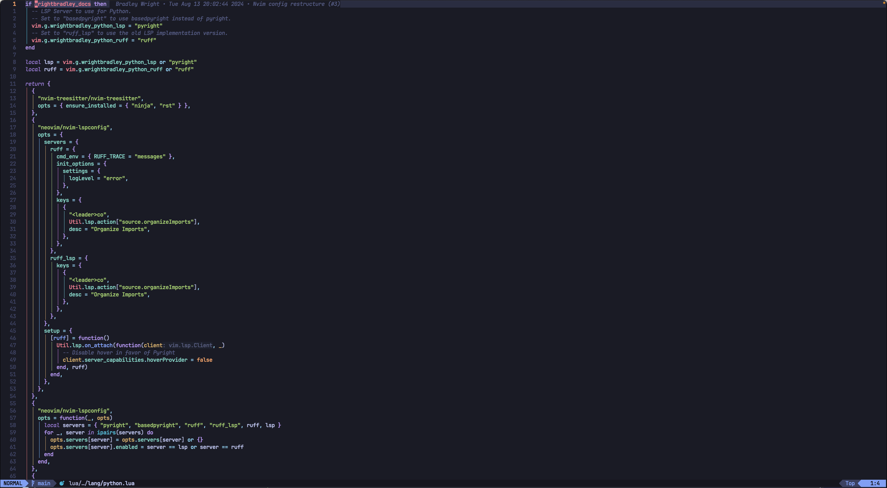

# nvim

This is my personal configuration for NeoVim. This was initial generated from
the [LazyVim](https://github.com/LazyVim/LazyVim) starter template. You can see
all the plugins I leverage [here](/docs/nvim-plugin-catalog.md).

## Various Screenshots

### Lazy.nvim Plugin Manager

### Mason support

### Which-key support

### Fuzzy Finder with fzf

### ChatGPT support

### Lazygit support

### Editor View

